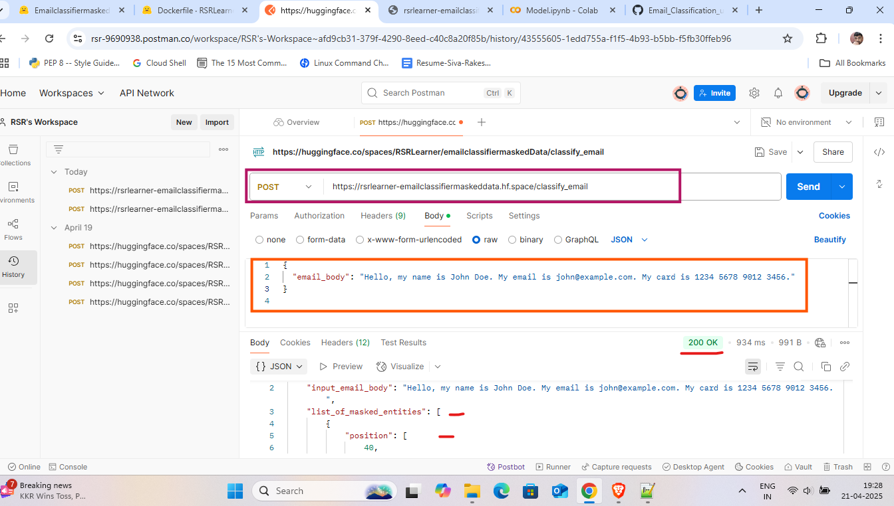

# Email_Classification_using_ML_Model

### Deployed ON Hugging Spaces
 
  -  API LINK : https://rsrlearner-emailclassifiermaskeddata.hf.space/classify_email
## API Using Postman - Screenshots


## API Usage

#### PII Masking Entities
The system detects and masks the following PII fields:

| Field Type | Masked As     |
| :-------- | :------- |
| `Full Name` | `[full_name]` | 
| `Email Address` | `[email]` | 
| `Phone Number` | `[phone_number]` | 
| `Date of Birth` | `[dob]` | 
| `Aadhar Card Number` | `[aadhar_num]` | 
| `Credit/Debit Number` | `[credit_debit_no]` | 
| `CVV Number` | `[cvv_no]` | 
| `Expiry Date` | `[expiry_no]` | 


**Request Body:**

```bash
  {
  "email_body": "Hi, my name is John Doe, phone 9876543210. I'm having trouble logging in."
  }

```

**Response Format:**
```bash
  {
  "input_email_body": "Hi, my name is John Doe, phone 9876543210. I'm having trouble logging in.",
  "list_of_masked_entities": [
    {
      "position": [17, 25],
      "classification": "full_name",
      "entity": "John Doe"
    },
    {
      "position": [33, 43],
      "classification": "phone_number",
      "entity": "9876543210"
    }
  ],
  "masked_email": "Hi, my name is [full_name], phone [phone_number]. I'm having trouble logging in.",
  "category_of_the_email": "Incident"
}
```


 -  Deployment Link : https://rsrlearner-emailclassifiermaskeddata.hf.space/
## Files

- app.py     --> **Entry point of the application**
- api.py     --> **API routes using FastAPI** 
- models.py   --> **Classification model training and prediction** 
- utils.py      --> **PII masking, demasking, helper functions**
- requirements.txt       --> **All dependencies listed here**
- README.md          --> **You're reading it!**         
- data/     --> **Sample data for testing and training**
- Email_Classification_API_Project_Report.pdf      --> **Short report with explanation**
